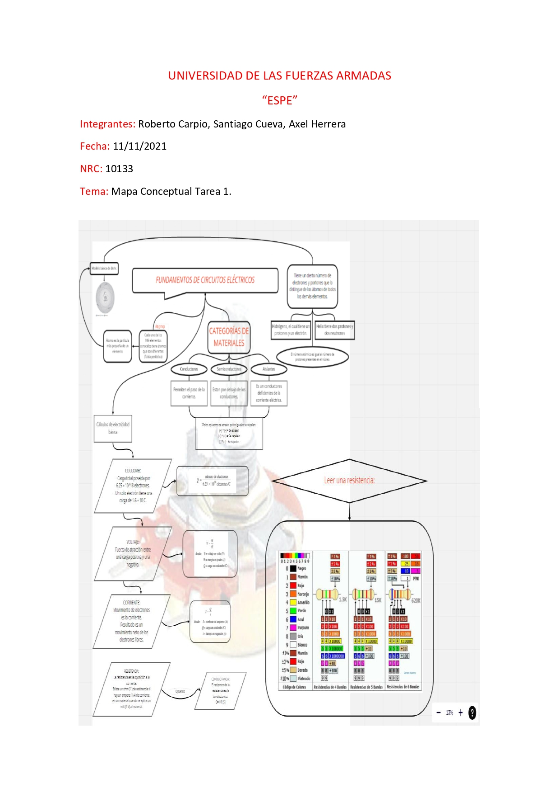
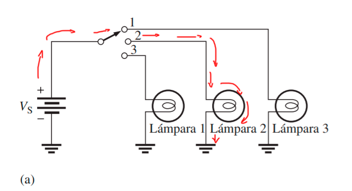
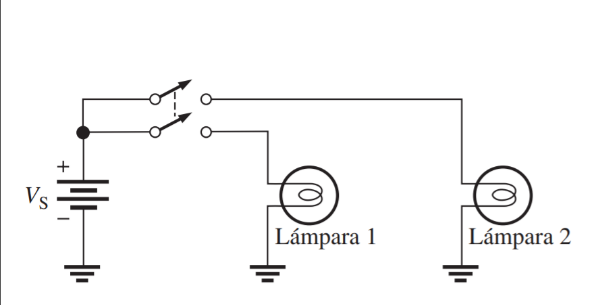
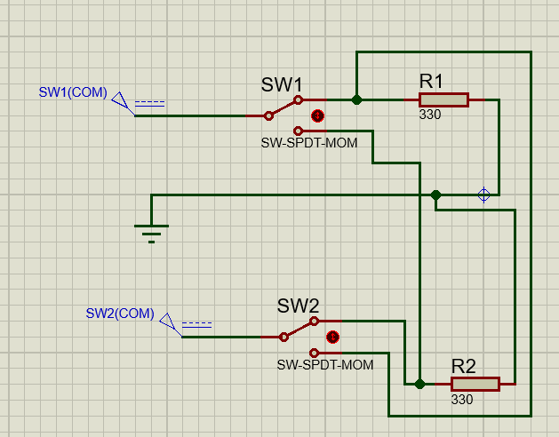
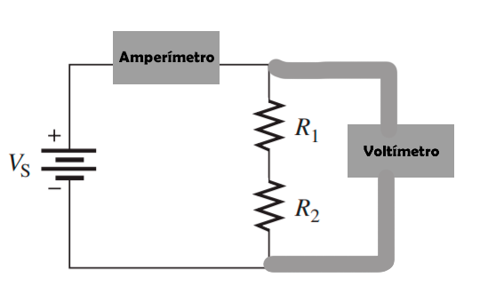
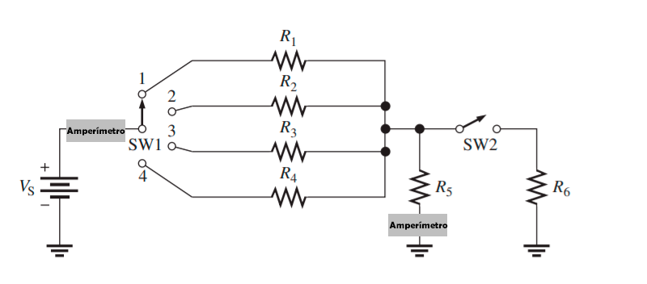

# INFORME-DE-TAREA-1
CAPITULO 1 Y 2
Objetivos:
Objetivo General:
Desarrollar ejercicios acerca de conversión de unidades, voltaje, corriente y resistencia, utilizando la materia del libro guía, para aprender a resolver problemas que se dan dentro de los circuitos.
Objetivos específicos:
- Calcular cantidades dadas en cada ejercicio, dados en diferentes notaciones, para aprender a manejar distintas situaciones de expresión de cantidades numéricas.
- Calcular las diferentes medidas presentes en un circuito, tales como voltaje, corriente y resistencia, para establecer la situación que se da dentro del mismo.
- Analizar las formas en la que una corriente puede circular dentro de un circuito, para determinar el escenario en donde funciona un circuito.
# MARCO TEÓRICO (RESUMEN)
Notación científica.
La notación científica busca reescribir los números extensos, de una manera más convenientes, por medio de la multiplicación y la potenciación. La potencia de diez se expresa como un exponente de la base 10 en cada caso (10^n) y el exponente es un numero el cual se eleva a la base e indica la cantidad de decimales que van de derecha e izquierda para producir el número decimal.
La estructura atómica
La materia tiene una estructura muy compleja y variada que se compone por átomos, que son partículas subatómicas, y estas son compuestas por electrones y neutrones. El núcleo se compone de partículas cargadas positivamente llamadas protones también de partículas no cargadas (neutrones) y las partículas básicas de carga negativa son los electrones.
Existen demasiados materiales, con categorías como son: conductores, semiconductores y aislantes. Los conductores son aquellos que permiten el paso de la corriente, tienen un gran numero de electrones libres y se caracterizan por poseer uno a tres electrones de valencia en su estructura, uno de los materiales más usados son el oro y el cobre.
Los semiconductores se clasifican por debajo de los conductores por el hecho de que conducen energía, pero no de la misma intensidad, por lo que tiene en su estructura atómica cuatro electrones de valencia, por estas características se constituyen la base de elementos electrónicos, se utiliza más el silicio y el germanio. Los aislantes son lo contrario de los conductores, no conducen la energía las repele, por el hecho de que su material evita la corriente, porque tienen muy pocos electrones libres.
La carga eléctrica, es una propiedad eléctrica de la materia que existe, que se simboliza con la letra Q, la electricidad estática es la presencia de una carga positiva o negativa en un material. Los materiales con polaridades se atraen entre sí, y con la misma se repelen. Entre las cargas actúa una fuerza, se la nombra como campo eléctrico que son líneas invisibles.
La fuerza de atracción que existe entre dos cargas distintas, se la llama voltaje, la cual se debe aplicar para separar las cargas, es la relación de energía y carga. Gracias a esta fuerza se presentan las fuentes de voltajes para proporcionar energía a un circuito, también esta no puede ser correctamente especifica por lo que varía, y estas pueden clasificarse como fuente de corriente alterno o continua.
La corriente, o la intensidad eléctrica, es producida por el movimiento de electrones, también se lo asemeja con la velocidad que lleva el flujo de la carga; en materiales conductores el número de electrones que fluyen más allá de cierto punto se llama corriente. Para la construcción de un circuito, se necesita frenar en algunos casos el paso de la corriente por lo que se utiliza un elemento llamado resistencia que es la que se opone al paso de electrones, y esta se expresa en ohms.
La resistencia se da gracias a los elementos que se denominan resistores o resistencias, que están disponibles en diversas formas, con la misma finalidad, un tipo muy común son los que están compuestos de carbón y resina. Y estas sin clasificadas por su valor con un código de colores.

Los circuitos básicos, se componen por una fuente, una carga y una trayectoria de corriente, o también se lo denomina actuadores. Los actuadores son los que ocupan la energía liberada para realizar un trabajo, por lo cual se llama transformación de energía. El estudio de estos circuitos básicos, bien consigo también la dirección de su corriente, la dirección de flujo de electrones y la dirección convencional de la corriente.

# Resolución de ejercicios
Notación científica
1.- Exprese cada uno de los números siguientes en notación científica
a.- 3000			b.- 75000			c.- 2000000
En la notación científica, siempre debe ser expresado al menos con un número entero
a.- 3000=3*1000=3*〖10〗^3
b.- 75000=7.5*10000=7.5*〖10〗^4
c.- 2000000=2*1000000=2*〖10〗^6

3.- Exprese cada uno de los números siguientes en notación científica
a.- 8400			b.- 99000			c.- 0.2*〖10〗^6
En la notación científica, siempre debe ser expresado al menos con un número entero
a.- 8400=8.4*1000=8.4*〖10〗^3
b.- 99000=99*1000=99*〖10〗^3
c.- 0.2*〖10〗^6=2*〖10〗^(-1)〖10〗^6=2〖10〗^5

5.- Exprese cada uno de los números siguientes en notación científica
a.- 32*〖10〗^3			b.- 6800*〖10〗^(-6)			c.- 870*〖10〗^8
En la notación científica, siempre debe ser expresado al menos con un número entero
a.- 32*〖10〗^3=3.2*10*〖10〗^3=3.2*〖10〗^4
b.- 6800*〖10〗^(-6)=6.8*1000*〖10〗^(-6)=6.8*〖10〗^3*〖10〗^(-6)=6.8*〖10〗^(-3)
c.- 870*〖10〗^8=8.7*100*〖10〗^8=8.7*〖10〗^2*〖10〗^8=8.7*〖10〗^10

7.- Exprese cada uno de los números siguientes como un número decimal regular.
a.- 2.5*〖10〗^(-6)			b.- 5.0*〖10〗^2		c.- 3.9*〖10〗^(-1)
Dependiendo del exponente ‘n’ al que se está elevando el número 10, se recorre el punto decimal ‘n’ espacios hacia la derecha (exponente positivo), o ‘n’ espacios hacia la izquierda (exponente negativo).
a.- 2.5*〖10〗^(-6)=2.5*1/〖10〗^6 =0.0000025
b.- 5.0*〖10〗^2=500
c.- 3.9*〖10〗^(-1)=3.9*1/10=0.39

9.- Sume los números siguientes
a.- (9.2*〖10〗^6 )+(3.4*〖10〗^7)      b.- (5*〖10〗^3 )+(8.5*〖10〗^(-1))	     c.- (5.6*〖10〗^(-8) )+(4.6*〖10〗^(-9))
Se deben igualar las potencias ‘n’ a las cuales está elevado el número 10, después, efectuar la suma de manera normal
a)(9.2*〖10〗^6 )+(3.4*〖10〗^7 )=(9.2*〖10〗^6 )+(34*〖10〗^6 )=(〖10〗^6 )(34+9.2)=43.2*〖10〗^6
b)(5*〖10〗^3 )+(8.5*〖10〗^(-1) )=(50000*〖10〗^(-1) )+(8.5*〖10〗^(-1) )=〖10〗^(-1) (5000+8.5)=5008.5*〖10〗^(-1)
c)(5.6*〖10〗^(-8) )+(4.6*〖10〗^(-9) )=(5.6*〖10〗^(-8) )+(0.46*〖10〗^(-8) )=〖10〗^(-8) (5.6+0.46)=6.06*〖10〗^(-8)

11.- Realice las siguientes multiplicaciones:
a.- (5*〖10〗^3)(4*〖10〗^5)       b.- (1.2*〖10〗^12)(3*〖10〗^2)	c.- (2.2*〖10〗^(-9))(7*〖10〗^(-6))
Las multiplicaciones se realizan con el siguiente principio:
- Las potencias de base 10, mantienen su base y se suman algebraicamente sus exponentes
- Los otros números se multiplican de manera normal

a) (5*〖10〗^3 )(4*〖10〗^5 )=(5*4)(〖10〗^(3+5) )=20*〖10〗^8=2*〖10〗^9
b)(1.2*〖10〗^12 )(3*〖10〗^2 )=(1.2*3)(〖10〗^(12+2) )=3.6*〖10〗^14
c) (2.2*〖10〗^(-9) )(7*〖10〗^(-6) )=(2.2*7)(〖10〗^(-9-6) )=15.4*〖10〗^(-15)=1.54*〖10〗^(-14)

Notación de ingeniería y prefijos métricos
13.- Exprese cada uno de los números siguientes en notación de ingeniería:
a.- 89000		b.- 450000	      c.- 12040000000000
En notación de ingeniería, los números deben estar expresados como un producto del número por 10 elevado a una potencia que sea múltiplo de 3.
a) 89000=89*〖10〗^3
b) 450000=450*〖10〗^3
c) 12040000000000=12040*〖10〗^9

15.- Exprese cada número en notación de ingeniería:
a.- 2.35*〖10〗^5	               b.- 7.32*〖10〗^7		   c.- 0.00000000129
En notación de ingeniería, los números deben estar expresados como un producto del número por 10 elevado a una potencia que sea múltiplo de 3.
a.- 2.35*〖10〗^5=2.35*〖10〗^3*〖10〗^2=235*〖10〗^3
b.- 7.32*〖10〗^7=7.32*〖10〗^6*10=73.2*〖10〗^6
c.- 0.00000000129=1.29*〖10〗^(-9)

17.- Sume los números siguientes y exprese cada resultado en notación de ingeniería:
a.- (2.5*〖10〗^(-3) )+(4.6*〖10〗^(-3))
b.- (68*〖10〗^6 )+(33*〖10〗^6)
c.- (1.25*〖10〗^6 )+(250*〖10〗^3)
Se igualan las potencias a un número múltiplo de 3, y se efectúan las sumas de manera normal.
a.- (2.5*〖10〗^(-3) )+(4.6*〖10〗^(-3) )=〖10〗^(-3) (2.5+4.6)=7.1*〖10〗^(-3)
b.- (68*〖10〗^6 )+(33*〖10〗^6 )=〖10〗^6 (68+33)=101*〖10〗^6
c.-(1.25*〖10〗^6 )+(250*〖10〗^3 )=(1250*〖10〗^3 )+(250*〖10〗^3 )=〖10〗^3 (1250+250)=1500*〖10〗^3=1.5*〖10〗^6

19.- Divida los números siguientes y exprese cada resultado en notación de ingeniería:
a) 50÷(2.2*〖10〗^3)	b) (5*〖10〗^3)÷(25*〖10〗^(-6))	c)(560*〖10〗^3)÷(660*〖10〗^3)
Las divisiones se realizan con el mismo principio que la multiplicación
a)50÷(2.2*〖10〗^3 )=22.72*〖10〗^(-3)
b)(5*〖10〗^3 )÷(25*〖10〗^(-6) )=0.2*〖10〗^(3+6)=0.2*〖10〗^9
c)(560*〖10〗^3 )÷(660*〖10〗^3 )=0.8484…〖10〗^0=848.48〖10〗^(-3)

21.- Exprese cada número del problema 15 en amperes por medio de un prefijo métrico.
a.- 2.35*〖10〗^5  A	     b.- 7.32*〖10〗^(7 ) A		c.- 0.00000000129 A
El resultado se expresa como prefijo métrico
a.- 2.35*〖10〗^5  A=2.35*〖10〗^3*〖10〗^2  A=235*〖10〗^3 A=235 KA
b.-7.32*〖10〗^7  A=7.32*〖10〗^6*10 A=73.2*〖10〗^6  A=73.2 MA
c.-0.00000000129 A=1.29*〖10〗^(-9)  A=1.29 nA

23.- Exprese cada una de las cantidades siguientes por medio de prefijos métricos:
a) 3*〖10〗^(-6) F		b)3.3*〖10〗^6 Ω		c) 350*〖10〗^(-9)  A

a) 3*〖10〗^(-6) F=3 uF
b) 3.3*〖10〗^6 Ω=3.3MΩ 
c) 350*〖10〗^(-9)  A=350nA

25.- Exprese cada cantidad convirtiendo el prefijo métrico en una potencia de 10:
a) 7.5 pA		b)3.3 GHz		c)280 nW

a.- 7.5 pA=7.5*〖10〗^(-12)  A
b.- 3.3 GHz=3.3*〖10〗^9  Hz
c.- 280 nW=280*〖10〗^(-9)  nW
27. Realice las conversiones indicadas:

	A) 5 mA a microamperios.
	1mA=1*10^3µA
	microamperios=(5mA* 1*10^3µA)/1mA
	microamperios=5*10^3µA

	B) 3200 µW a mili watt.
	1 µW=1*10^(-3) mW
	mili watt=(3200 µW* 1*10^(-3) mW)/(1µW)
	mili watt=3,2 mW

	C) 5000 kV a mega volt
	1 KV=1*10^(-3) MV
	mega volt=(5000 kV* 1*10^(-3) MV)/(1 KV)
	mega volt=5MV

	D) 10 MW a kilowatts
	1 MW=1*10^3 KV
	kilowatts=(10 MW* 1*10^(-3) KW)/(1 MW)
	kilowatts=1000000MV

29) Sume las siguientes cantidades:

	A) 50 mA + 680 µA
	1 µA=1*10^(-3) mA
	miliamperio=(680 µA* 1*10^(-3) mA)/(1µA)
	miliamperio=0,68mA
	Suma=50mA+0,68mA=50,68mA

	B) 120KΩ+2,2MΩ
	1 KV=1*10^(-3) MV
	MΩ=(120KΩ* 1*10^(-3) MΩ)/1KΩ
	MΩ=0,12MΩ
	Suma=2,2MΩ+0,12MΩ=2,32MΩ

	C) 0,02µF+3300pF
	1 pF=1*10^(-6)µF
	µF=(3300pF* 1*10^(-6)µF)/(1 pF)
	µF=0,0033µF
	Suma=0,02µF+0,0033µF=0,0233µF

1.¿Cuál es la carga en coulomb del núcleo de un átomo de cobre?

	Q=(#e)/(6,25*10^18  e/c)
	Q=29e/(6,25*10^18  e/c)
	Q=4,64*10^(-18) c

3.¿Cuántos coulomb de carga poseen 50 *10^31 electrones?

	Q=(#e)/(6,25*10^18  e/c)
	Q=(50*10^31 e)/(6,25*10^18  e/c)
	Q=8*10^13 c

5.Determine el voltaje en cada uno de los siguientes casos:

	A) 10J/C
	V=([J])/([C])
	V=10V

	B) 5J/2C
	V=([J])/([C])
	V=5/2 V=2.5V

	C) 100J/25C
	V=([J])/([C])
	V=4V

7.¿Cuál es el voltaje de una batería que utiliza 800 J de energía para mover 40 C de carga a través de un resistor?

	V=([J])/([C])
	V=(800  [J])/(40  [C])
	V=20V

9.Si un resistor con una corriente de 2 A a través de él convierte 1000 J de energía eléctrica en energía calorífica en 15 s, ¿cuál es el voltaje a través del resistor?

	A=([C])/([S])
	2 A=([C])/(15 [S])
	[C]=15 [S]*2A
	[C]=30c

	V=([J])/([C])
	V=(1000 J )/30c
	V=100/3 V
	V=33.3V  

11.Seis décimos de coulomb pasan por un punto en 3 s. ¿Cuál es la corriente en amperes?

	6 decimos coulomb=0,6 coulomb
	A=(0,6 [C])/(3 [s])
	A=0,2 A

13.¿Cuántos coulomb pasan por un punto en 0,1 s cuando la corriente es de 1,5 A?

	A=([C])/([s])
	1,5 A=([C])/(0,1  [s])

	[C]=11,5 A*0,1s
	[C]=0.15 c

15.Determine la conductancia (G) para cada uno de los siguientes valores de resistencia:

		A) 5Ω
	G=1/R[S]
	G=1/5Ω[S]
	G=0,2[S]
	G=200[mS]

		B) 25Ω
	G=1/R[S]
	G=1/25Ω[S]
	G=0,04[S]
	G=400[mS]

		C) 100Ω
	G=1/R[S]
	G=1/100Ω[S]
	G=0,01[S]
	G=10[mS]

17.Enliste cuatro fuentes de voltaje comunes.

	1 = Batería.
	2 = Celda solar.
	3 = Generador.
	4 = Fuente electrónica de potencia.
  
19.¿Cómo difiere una fuente electrónica de potencia de las demás fuentes de voltaje?

	La corriente alterna la transforma en corriente continua.
  
21.Determine los valores de resistencia y tolerancia para los siguientes resistores de 4 bandas.

		A) rojo, violeta, naranja, oro
	rojo = 2, violeta = 7, naranja = 3, oro = ±5%
	Resistencia = 27000 Ω ±5% =27KΩ
		B) café, gris, rojo, plata
	café = 1, gris = 8, rojo = 2, plata = ±10%
	Resistencia = 1800 Ω ±10% = 1,8KΩ ±10%

23.Determine las bandas de color para cada uno de los siguientes valores de 4 bandas y 5% de tolerancia:

330 Ω
Naranja, naranja, café, dorado
2,2 kΩ
Rojo, rojo, naranja, dorado
56 kΩ
Verde, azul, naranja, dorado
100 kΩ
Café, negro, café, dorado
39 kΩ
Naranja, blanco, naranja, dorado

25.Determine las bandas de color para cada uno de los siguientes resistores de 4 bandas. Asuma que cada resistor tiene una tolerancia del 5 por ciento.

a) 0,47 Ω
Amarillo, violeta, Plata, dorado

b) 270 kΩ
Rojo, Violeta, Café, dorado

c) 5,1 MΩ
Verde, Café, Verde, dorado

27.Determine las bandas de color para cada uno de los siguientes resistores de 5 bandas. Asuma que cada resistor tiene tolerancia del 1 por ciento.

a) 14,7 kΩ
Café, Amarillo, Violeta, Rojo, Café 

b) 39,2 Ω
Naranja, Blanco, Rojo, Oro, Café 

c) 9,76 kΩ
Blanco, Violeta, Azul, Café, Café 

29.¿Cuál es la resistencia indicada por 4K7?

Amarillo, violeta, rojo, plateado

31.Trace la trayectoria de la corriente en la figura 2-69(a) con el interruptor en la posición 2.

  
La lampara 2 se enciende por lo que la corriente pasa por el interruptor en la posición número dos.

33.En la figura 2-69, solamente hay un circuito en el cual es posible encender todas las lámparas al mismo tiempo. Determine cuál es este circuito.

Es el circuito (b) por lo que es un interruptor doble que funciona y da paso a la corriente en dos direcciones para el encendido de todas las lámparas del circuito.

35.Disponga un arreglo de interruptor mediante el cual se puedan conectar dos fuentes de voltaje (VS1 y VS2) al mismo tiempo a cualquiera de dos resistores (R1 y R2) como sigue:

VS1 conectada a R1 y VS2 conectada a R2
o VS1 conectada a R2 y VS2 conectada a R1

37.Muestre la colocación de un amperímetro y un voltímetro para medir la corriente y el voltaje de fuente en la figura 2-72.

39.En la figura 2-73 ¿cuánto voltaje indica cada medidor cuando el interruptor está en la posición 1? ¿En la posición 2?

En la posición 1 y en la posición va ser la misma de la fuente si es que está estaría conectada en el polo positivo, y como ese no es el caso, el circuito no se enciende por el motivo que está conectado de forma errónea.

41.En la figura 2-70, muestre la colocación apropiada de los amperímetros para medir la corriente a través del resistor y la que sale de la batería.

43. Cuál es la lectura de voltaje del medidor mostrado en la figura 2-74?

12,5 voltios por el hecho de que está en corriente directa.

45.Determine la resistencia indicada por cada una de las siguientes lecturas y ajustes de intervalo de ohmmetro:

(a) manecilla en 2, ajuste de intervalo en x10
20 ohmios

(b) manecilla en 15, ajuste de intervalo en x100,000
1500000 ohmios o 1500k ohmios

(c) manecilla en 45, ajuste de intervalo en x100
4500 ohmios

47.Indique en qué forma conectaría el multímetro de la figura 2-75 al circuito de la figura 2-76 para medir cada una de las siguientes cantidades. Incluya la función y el intervalo apropiados en todos los casos. 

(a) I1                                                                    
En serie a las dos ultimas resistencias un polo al final de las resistencias y a l punto tierra. La perilla debe estar seleccionando a 1.2 para la toma de intensidad en el intervalo de uno a dos. Cabe recalcar que los dos cables conectados al multímetro deben estar en el agujero de mA y común.

(b) V1 
Para el voltaje debe esta en AC y 1 en el intervalo de 12

(c) R1
Lo sacamos del circuito eléctrico y se lo mide, en la perilla en 45 en el intervalo de x1000

# VIDEO
https://youtu.be/HYOt6INptYA

# Cconclusiones

-Logramos realizar varios ejercicios la cual ayuda al desarrollo de nuevos conocimientos para nosotros y ayuda a fortalecer los conocimientos adquiridos de forma teórica

-Se calcularon las cantidades dadas en los ejercicios en diferentes notación, con lo que se se pueden resolver distintos ejercicios aplicados a Circuitos.

-La cantidad de voltaje de una fuente de voltaje no es fijo porlo que no se puede determinar un valor con exactitud.

# Bibliografia
Floyd, T. (2007). Voltaje, corriente y resistencia. En L. M. Cruz Castillo (Ed.), Principios de Circuitos Eléctricos (VIII ed., pp. 16-71). Pearson Educación.
Floyd, T. (2007). Cantidades y unidades. En L. M. Cruz Castillo (Ed.), Principios de Circuitos Eléctricos (VIII ed., pp. 1-15). Pearson Educación
Abreu, R. (2005). Fuentes de alimentación conmutadas. El1313-Electrónica III 2005, 4,5. http://www.el.bqto.unexpo.edu.ve/rabreu/Electronica3/Clase9.pdf

